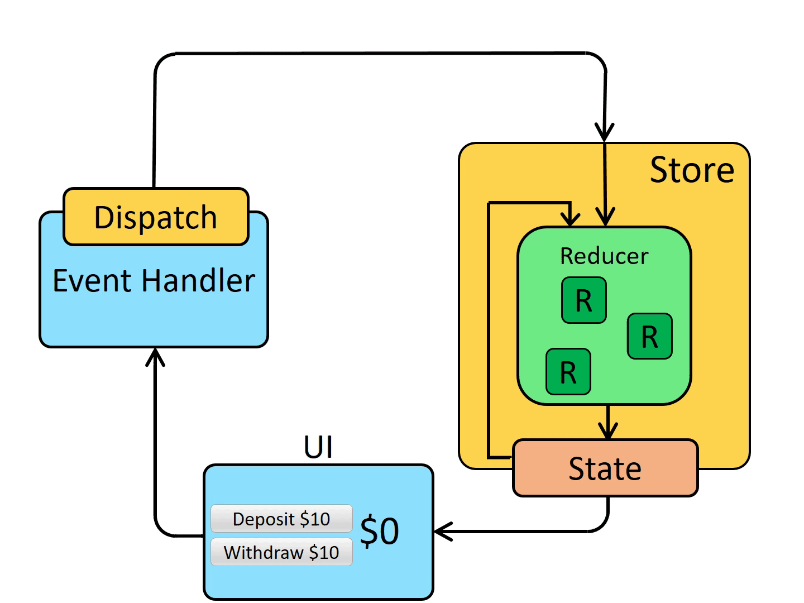

# Redux & React Redux (Redux Toolkit)

---

##   Title

Redux & React Redux
Using Redux Toolkit

---

##   Agenda

* What is State Management?
* Introduction to Redux
* Core Concepts
* Redux Architecture
* Redux Toolkit
* React Redux Integration
* End-to-End Example

---

##  What is State?

State is the data that controls the behavior and rendering of an application.

---

##   Types of State

* Local State (Component level)
* Global State (App level)

---

##   Why State Management?

* Share data across components
* Avoid prop drilling
* Maintain predictable data flow

---
## What is prop Drilling
<i>Prop drilling in React is the process of passing data (props) from a parent component down through multiple layers of intermediate components in the component tree, even when those intermediate components do not need the data themselves, in order to reach a deeply nested component that actually requires it</i>

---
## State Management - 1
```js
function Counter() {
  // State: a counter value
  const [counter, setCounter] = useState(0)

  // Action: code that causes an update to the state when something happens
  const increment = () => {
    setCounter(prevCounter => prevCounter + 1)
  }

  // View: the UI definition
  return (
    <div>
      Value: {counter} <button onClick={increment}>Increment</button>
    </div>
  )
}
```
---

## State management - 2

The **state**, the source of truth that drives our app;
The **view**, a declarative description of the UI based on the current state
The **actions**, the events that occur in the app based on user input, and trigger updates in the state
This is a small example of **"one-way data flow"**

---
## What is Redux?

Redux is a predictable state container for JavaScript applications.

---

##  Key Idea of Redux

Centralized store that holds the entire application state.

---

##  Redux Principles

1. Single Source of Truth
2. State is Read-only
3. Changes via Pure Functions

---

##   Single Source of Truth

All state is stored in one object tree inside a store.

---

##    State is Read-only

State cannot be modified directly. Changes happen via actions.

---

##    Pure Functions

Reducers are pure functions that return new state.

---

##    Redux Data Flow

UI -> Action -> Reducer -> Store -> UI
<p style="text-align:center">

</p>

---

##   What is an Action?

An action is a plain JavaScript object describing what happened.

---

##   Action Example

```
{ type: 'INCREMENT' }

{ type: 'INCREMENT',payload:20 }
```

---

##   What is a Reducer?

A reducer is a function that takes current state and action and returns new state.

---

## Reducer Example

```
function counterReducer(state = 0, action) {
  switch(action.type) {
    case 'INCREMENT': return state + 1;
    default: return state;
  }
}
```

---

##   What is Store?

Store holds the application state and provides methods to update it.

---

##   Store Responsibilities

* Hold state
* Dispatch actions
* Register reducers

---

##   Dispatch

Dispatch is used to send actions to the store.

---

##   Redux Architecture Summary

* UI dispatches action
* Reducer processes action
* Store updates state
* UI re-renders

---

##   Limitations of Traditional Redux

* Boilerplate code
* Complex setup
* Hard to scale

---

##   What is Redux Toolkit?

Redux Toolkit is the official, recommended way to write Redux logic.

---

##   Benefits of Redux Toolkit

* Less boilerplate
* Built-in best practices
* Simplified state updates

---

##    Core APIs of Redux Toolkit

* configureStore
* createSlice
* createAsyncThunk

---

##    configureStore

Creates a Redux store with good defaults.

---

##    createSlice

Generates reducers and actions automatically.

---

##    Slice Concept

A slice is a portion of the state with its own logic.

---

##    createSlice Example

```
import { createSlice } from '@reduxjs/toolkit';

const counterSlice = createSlice({
  name: 'counter',
  initialState: { value: 0 },
  reducers: {
    increment: (state) => { state.value += 1; },
    decrement: (state) => { state.value -= 1; }
  }
});

export const { increment, decrement } = counterSlice.actions;
export default counterSlice.reducer;
```

---

##   Immutable Updates Made Easy

Redux Toolkit uses Immer to allow direct state mutation.

---

##   Store Setup

```
import { configureStore } from '@reduxjs/toolkit';
import counterReducer from './counterSlice';

export const store = configureStore({
  reducer: {
    counter: counterReducer
  }
});
```

---

##   What is React Redux?

React Redux is the official binding between React and Redux.

---

##   Key Features of React Redux

* Connect React to store
* Efficient re-rendering

---

##   Provider Component

Makes the Redux store available to React components.

---

##   Provider Example

```
import { Provider } from 'react-redux';
import { store } from './store';

<Provider store={store}>
  <App />
</Provider>
```

---

##   useSelector Hook

Used to access state from store.

---

##   useDispatch Hook

Used to dispatch actions.

---

##   useSelector Example

```
const count = useSelector(state => state.counter.value);
```

---

##   useDispatch Example

```
const dispatch = useDispatch();
dispatch(increment());
```

---

##   Folder Structure

* store.js
* features/
* components/

---

##   End-to-End Example Intro

Counter Application using Redux Toolkit

---

##  counterSlice.js

```
import { createSlice } from '@reduxjs/toolkit';

const counterSlice = createSlice({
  name: 'counter',
  initialState: { value: 0 },
  reducers: {
    increment: state => { state.value += 1 },
    decrement: state => { state.value -= 1 }
  }
});

export const { increment, decrement } = counterSlice.actions;
export default counterSlice.reducer;
```

---

##  store.js

```
import { configureStore } from '@reduxjs/toolkit';
import counterReducer from './counterSlice';

export const store = configureStore({
  reducer: {
    counter: counterReducer
  }
});
```

---

##   index.js

```
import React from 'react';
import ReactDOM from 'react-dom';
import { Provider } from 'react-redux';
import { store } from './store';
import App from './App';

ReactDOM.render(
  <Provider store={store}>
    <App />
  </Provider>,
  document.getElementById('root')
);
```

---

##   App.js

```
import React from 'react';
import Counter from './Counter';

function App() {
  return <Counter />;
}

export default App;
```

---

##   Counter Component

```
import React from 'react';
import { useSelector, useDispatch } from 'react-redux';
import { increment, decrement } from './counterSlice';

function Counter() {
  const count = useSelector(state => state.counter.value);
  const dispatch = useDispatch();

  return (
    <div>
      <h1>{count}</h1>
      <button onClick={() => dispatch(increment())}>+</button>
      <button onClick={() => dispatch(decrement())}>-</button>
    </div>
  );
}

export default Counter;
```

---

##   Flow Recap

* Component dispatches action
* Reducer updates state
* UI re-renders

---

##   Best Practices

* Use slices
* Keep reducers simple
* Normalize state

---

##   When to Use Redux

* Large applications
* Shared state across many components

---

##   When NOT to Use Redux

* Small apps
* Simple state

---

##   Conclusion

Redux Toolkit simplifies Redux.
React Redux integrates it seamlessly.

---

##    Q&A

Questions?
